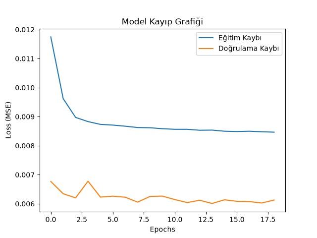
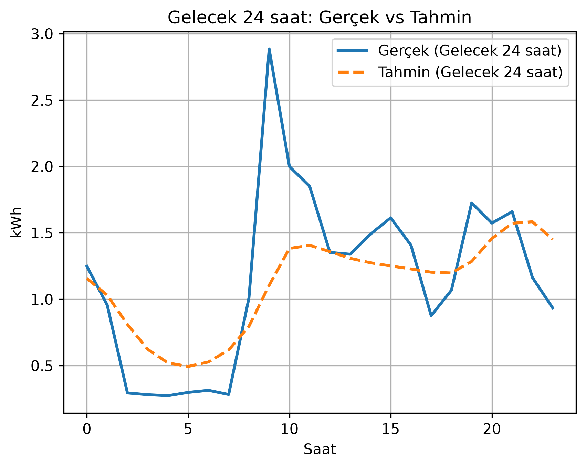

# ⚡ Hourly Energy Consumption Forecasting with LSTM

> 🌐 **Language / Dil Options:**  
> [ 🇬🇧 Switch to English Section ](#-english-version) | [ 🇹🇷 Türkçe Bölümüne Git ](#-türkçe-versiyon)

---

## 🇬🇧 English Version

Predicting electric power consumption is critical for power grid balancing, load planning, grid optimization, and billing operations. This project builds an end-to-end deep learning workflow using a **Long Short-Term Memory (LSTM)** recurrent neural network architecture to forecast next-day (24-hour) energy demand using historical consumption data.

### 📌 Dataset Overview
* **Source:** UCI Machine Learning Repository — *Individual Household Electric Power Consumption Data Set*
* **Target Variable:** `Global_active_power` (Total active power consumed in kilowatts)
* **Temporal Resolution:** Aggregated from minute-by-minute recordings into hourly average values.

### 🛠️ Data Pipeline & Methodology
1. **Data Loading & Cleaning:** Parsed semi-colon separated raw CSV structure and merged distinct date and time features into a unified datetime index.
2. **Resampling:** Transformed granular minute-level data into hourly means to extract macroeconomic daily consumption signatures.
3. **Sliding Window Transformation:** Engineered sequence inputs ($X$) and targets ($y$) using a 24-hour historical lookback window to predict the subsequent hour's consumption.
4. **Feature Normalization:** Scaled consumption attributes between 0 and 1 via `MinMaxScaler` to facilitate stable gradient descent in LSTM layers.
5. **Model Architecture:** Built a TensorFlow/Keras Recurrent Neural Network incorporating LSTM units with explicit forget, input, and output gates to overcome the vanishing gradient problem.
6. **Iterative 24-Hour Autoregressive Forecasting:** Executed multi-step recursive forecasting to project energy demand across a 24-hour target horizon.

### 📈 Model Loss Performance Analysis

* **Train vs. Validation Loss:** Both training loss and validation loss decreased monotonically from early epochs, indicating stable optimization without underfitting.
* **Overfitting Control:** The minimal dynamic gap between training and validation loss curves confirms strong generalization capabilities across unseen temporal distributions.
* **Early Stopping Integration:** Model training converged around epoch 14 (achieving optimal `val_loss` ≈ 0.006), automatically restoring best-performing network weights.

### 📊 24-Hour Horizon Forecast Performance & Visual Analysis

* **Off-Peak Night Trends (Hours 0–5):** The model accurately captured off-peak consumption troughs ($\approx 0.5\text{ kWh}$), reflecting true domestic nighttime baseline energy consumption.
* **Morning Demand Spike (Hours 9–10):** Observed a sharp sudden surge in historical demand ($\approx 2.8\text{ kWh}$). While predicting an upward trend ($\approx 1.4\text{ kWh}$), the model demonstrated a *smoothing effect* on extreme peak magnitudes—a characteristic behavior of univariate time-series models handling isolated volatility spikes.
* **Extended Horizons (Hours 15–24):** As the model iteratively utilized its own prior predictions as historical inputs, variance gradually diminished toward the global temporal mean line due to autoregressive error propagation.

### 🚀 Future Improvements & Strategic Roadmap
* **Multivariate Expansion:** Integrate exogenous parameters such as hour-of-day, day-of-week, calendar events, and local ambient temperature to capture sharp localized demand spikes.
* **Seq2Seq Architecture:** Transition from iterative step-by-step autoregression to an **Encoder-Decoder Sequence-to-Sequence (Seq2Seq)** LSTM structure to minimize compound error propagation across multi-step forecast horizons.

---

## 🇹🇷 Türkçe Versiyon

Enerji tüketimi tahmini; elektrik üretim planlama, şebeke dengeleme, tüketim öngörülmesi ve faturalama optimizasyonu açısından kritik bir öneme sahiptir. Bu projede, geçmiş tüketim verilerine bakarak gelecek 24 saatlik enerji tüketimini tahmin etmek amacıyla uçtan uca bir **LSTM (Long Short-Term Memory)** derin öğrenme modeli geliştirilmiştir.

### 📌 Veri Seti Özeti
* **Kaynak:** UCI Machine Learning Repository — *Individual Household Electric Power Consumption*
* **Hedef Değişken:** `Global_active_power` (Kilowatt cinsinden toplam aktif güç)
* **Zaman Çözünürlüğü:** Dakikalık veriler saatlik ortalama değerlere dönüştürülmüştür.

### 🛠️ Veri İşleme ve Yöntem
1. **Veri Yükleme ve Temizleme:** Noktalı virgül (`;`) ile ayrılmış CSV verisi okundu, tarih ve saat sütunları birleştirilerek zaman serisi indeksi oluşturuldu.
2. **Yeniden Örnekleme (Resampling):** Gürültüyü azaltmak ve günlük genel tüketim paternini yakalamak amacıyla dakikalık veriler saatlik ortalamalara dönüştürüldü.
3. **Kayan Pencere (Sliding Window):** Son 24 saatin verisini girdi ($X$), bir sonraki saatin değerini hedef ($y$) alacak şekilde dizilimler oluşturuldu.
4. **Veri Ölçekleme (Scaling):** LSTM modelinin kararlı gradient inişi yapabilmesi için veriler `MinMaxScaler` ile 0-1 aralığına normalize edildi.
5. **Model Mimarisi:** Gradyan sönmesi (vanishing gradient) problemini aşmak amacıyla Unutma (Forget), Girdi (Input) ve Çıktı (Output) kapılarına sahip TensorFlow/Keras LSTM mimarisi kuruldu.
6. **24 Saatlik Otoregresif Tahmin:** Gelecek 24 saatin tüketimi adım adım (iteratif) olarak öngörüldü.

### 📈 Model Eğitim Kayıp Grafiği (Loss Graph)

* **Train vs Val Loss:** Hem Eğitim Kaybı (Train Loss) hem de Doğrulama Kaybı (Validation Loss) ilk epoch'lardan itibaren kararlı bir şekilde düşmüştür.
* **Overfitting Kontrolü:** İki çizginin birbirine yakın seyretmesi modelin ezber yapmadığını (overfitting olmadığını) ve veriyi genelleştirebildiğini gösterir.
* **Early Stopping:** Model 14. epoch civarında doğrulama kaybının (`val_loss` ≈ 0.006) en düşük seviyeye ulaşmasıyla eğitimi durdurmuş ve en iyi ağırlıkları kaydetmiştir.

### 📊 Gelecek 24 Saatlik Tahmin Performansı ve Grafik Analizi

1. **Trend ve Sezonluk Uyumluluk (Trend Tracking):**
   * **Gece Düşüşü (0–5. Saatler):** Model, günün ilk saatlerindeki tüketim düşüşünü ve dip noktasını (~0.5 kWh) yüksek bir başarıyla yakalamıştır.
   * **Genel Eğilim:** Gerçek verideki yükseliş ve düşüş trendlerine paralel bir hareket sergilemekte; zaman serisinin genel paternini doğru öğrenmektedir.

2. **Pik Tüketim Noktaları (Peak Demand / Outliers):**
   * **9–10. Saat Piki:** Gerçek tüketim verisinde günün sabah saatlerinde aniden ortaya çıkan keskin talep artışı (~2.8 kWh) gözlemlenmiştir.
   * Model bu noktada bir artış öngörse de (~1.4 kWh seviyesi), pikin şiddetini tam olarak yakalayamamış ve çıktıyı yumuşatma (smoothing) eğilimi göstermiştir. Bu durum, tek değişkenli (univariate) zaman serisi modellerinde ani talep sıçramalarında sıkça karşılaşılan bir davranıştır.

3. **Otoragresif Hata Birikimi (Error Propagation):**
   * Tahmin ufku ilerledikçe (15–24. saatler), model kendi ürettiği geçmiş tahminleri girdi olarak kullanmaya devam ettiği için tahmin çizgisi gerçek veriye kıyasla daha durağan/ortalama bir hatta çekilmiştir.

### 💡 Sonuç ve Gelecek Çalışmalar (Future Improvements)

* **Mevcut Durum:** Tek bir geçmiş tüketim değişkeni kullanılarak inşa edilen bu temel LSTM mimarisi, genel enerji tüketim seviyesini ve günlük ritmi başarılı bir şekilde temsil etmektedir.
* **Modeli Geliştirme Önerileri:**
  * **Çok Değişkenli Yapı (Multivariate Forecasting):** Saat, gün (hafta içi/hafta sonu), takvim etkileri ve hava sıcaklığı gibi dışsal değişkenlerin (exogenous features) modele eklenmesi, 9. saatteki gibi ani piklerin daha hassas öğrenilmesini sağlayabilir.
  * **Seq2Seq Architecture:** Adım adım (step-by-step) tahmin yerine Encoder-Decoder tabanlı Seq2Seq LSTM yapısına geçilerek uzun vadeli tahminlerdeki hata birikimi azaltılabilir.

---
*Developed by **[Buse Yurt](https://github.com/buseyurtcontact-code)** — BSc Statistics Student*
